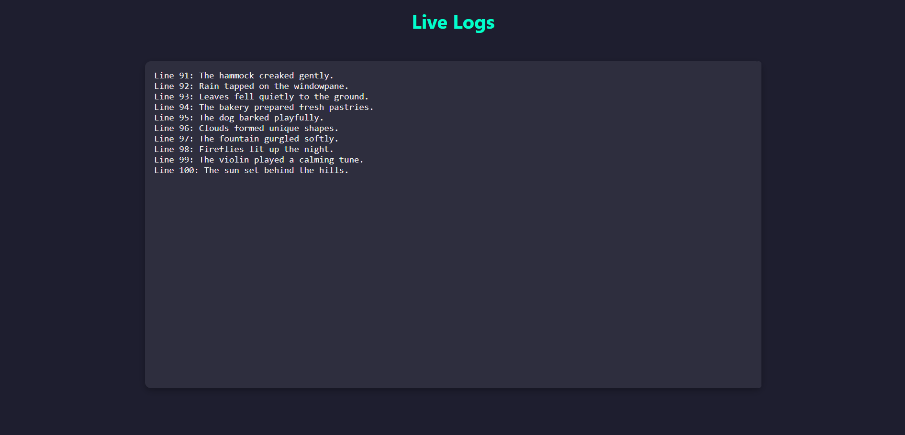

# Real-time Log Watcher

A lightweight tool to stream updates from a log file (like `tail -f`) to a web-based client in real-time using Flask and Socket.IO.

## Features

- Real-time streaming of new log lines
- Displays last 10 lines on initial page load
- Auto-scrolls on updates
- Handles concurrent clients
- Optimized for large log files

## How It Works

1. A Flask server reads and monitors the log file for changes.
2. When updates occur, the server emits the new lines via WebSocket.
3. The client receives updates without page refresh.

